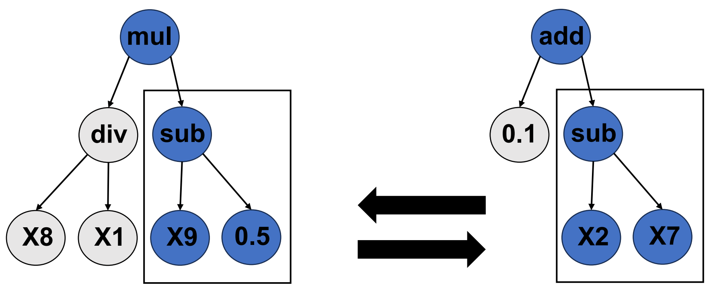
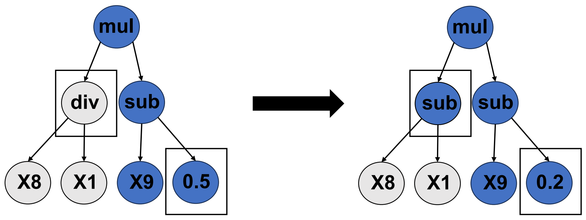
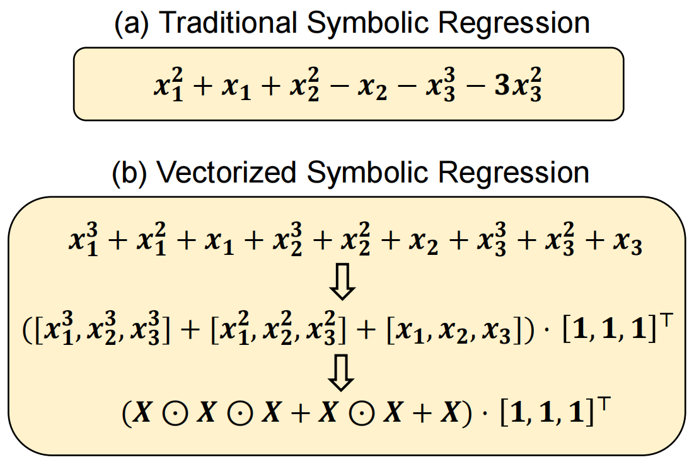

Introduction and Guidelines
===========================

Why Task-based Neurons?
-----------------------
In the past decade, a majority of deep learning research is on designing outstanding architectures, such as the bottleneck in autoencoders [1]_, shortcuts [2]_ [3]_, and neural architecture search (NAS) [4]_. Almost exclusively, these works employ neurons of the same type that use an inner product and a nonlinear activation. We refer to such a neuron as a linear neuron, and a network made of these neurons as a linear network (LN) hereafter. Recently, the field “NeuroAI" emerged [5]_ to advocate that a large amount of neuroscience knowledge can help catalyze the next generation of AI. This idea is well-motivated, as the brain remains the most intelligent system to date, and an artificial network can be regarded as a miniature of the brain. Following the advocacy of “NeuroAI", it is noted that our brain is made up of many functionally and morphologically different neurons, while the existing mainstream artificial networks are homogeneous at the neuronal level. Thus, why not introduce neuronal diversity into artificial networks and examine associated merits?

Our overarching opinion is that the neuron type and architecture are two complementary dimensions of an artificial network. Designing well-performing neurons represents a new dimension relative to designing well-performing architectures. Therefore, the neuronal type should be given full attention to harness the full potential of connectionism. In recent years, a plethora of studies have introduced new neurons into deep learning [6]_ [7]_ [8]_ [9]_ [10]_ [11]_ such as polynomial neurons [6]_ and quadratic neurons [7]_ [8]_ [9]_ [10]_ [11]_. Despite focusing only on a specific type of neuron, this thread of studies reasonably verifies the feasibility and potential of developing deep learning with new neurons.

Biological neuronal diversity, both in terms of morphology and functionality, arises from the brain's needs to perform complex tasks [12]_. The brain does not rely on a single type of neuron to universally function in all aspects. Instead, it acts as a sophisticated designer of task-based neurons. Hence, in the realm of deep learning, we think that promoting neuronal diversity should also not be limited to specific neuron types like linear or quadratic neurons. Instead, it should take into account the specific context of the tasks at hand. Can we design different neurons for different tasks (task-based neurons)? Computationally, the philosophy of task-based architectures and task-based neurons is quite distinct.

The former is “one-for-all”, which implicitly assumes that stacking a universal and basic type of neurons into different structures can solve a wide class of complicated nonlinear problems. This philosophy is well underpinned by the universal approximation theorem [13]_. The latter is “one-for-one", which assumes that there are no one-size-fits-all neuron types, and it is better to solve a specific problem by prototyping customized neurons. Because task-based neurons are imparted with the implicit bias for the task, the network of task-based neurons can integrate the task-driven forces of all these neurons, which given the same structure should exhibit stronger performance than the network of generic neurons. The key difference between task-based neurons and preset neurons is that the mathematical expression in the task-based neurons is adaptive according to the preference of the task, while in the preset neurons, the mathematical expression is preset.

What Are Task-based Neurons?
----------------------------

1. Vectorized Symbolic Regression
,,,,,,,,,,,,,,,,,,,,,,,,,,,,,,,

Unlike traditional regression algorithms that fit numerical coefficients, symbolic regression first encodes a formula into a tree structure and then uses a genetic algorithm to explore the space of possible mathematical expressions to identify the best formula. Because no gradients with respect to the mathematical formula can be computed, the most common technique for solving symbolic regression problems is genetic programming (GP) [14]_. GP is a powerful population-based evolutionary algorithm, which mainly uses crossover and mutation to generate new formulas. The following two figures illustrate the schematic diagrams of crossover and mutation respectively.

**Crossover** is a genetic programming operation to generate new individuals by means of subtree crossover among the selected individuals, and then explore the symbolic expression space. The specific method is to randomly select subtrees of the winner candidates and exchange them. This operation promotes diversity in the population and can lead to the discovery of new and more effective mathematical formulas.

**Mutation** is a genetic programming operation to randomly select a position of an individual, and generate a new individual through single-point mutation. Due to the randomness of mutation, it can re-join some functions and variables that were eliminated before, thereby potentially leading to the discovery of novel and effective expressions. By injecting variability into the population, mutation plays a crucial role in exploring the solution space and preventing premature convergence to suboptimal solutions.

In prototyping task-based neurons, we consider three important aspects:

* How to efficiently design task-based neurons?
* How to make the resultant neurons transferable to a network?
* How to transfer the superiority at the neuronal level to the network level?

We find that the traditional symbolic regression cannot fulfill these needs, particularly for high-dimensional inputs, due to three problems: First, the regression process of traditional symbolic regression becomes slow and computationally expensive for high-dimensional inputs. The search space becomes vast for high-dimensional inputs, as it requires checking an arbitrary form of interactions among two or more input variables. Second, the formulas learned by the traditional symbolic regression are heterogeneous, which suffers from the parametric explosion for high-dimensional inputs and does not support parallel computing and GPU acceleration. Thus, such formulas cannot serve as the aggregation function of a neuron because the resultant neuron cannot be easily integrated into deep networks. Third, the traditional symbolic regression may learn overly complex formulas, subjected to the risk of overfitting when connecting those neurons into a network.

To address these problems, we propose a solution called vectorized symbolic regression. This approach regularizes every variable to learn the same formula, allowing us to organize all variables into a vector. The formulas are then based on vector computation, as illustrated in the following Figure. Unlike traditional symbolic regression, which tends to identify a heterogeneous formula. The vectorized symbolic regression is simple yet mighty, which has valuable characteristics suitable to this task:

**Regression Speed**: The vectorized symbolic regression decreases the computational complexity of the regression process, making it much faster than traditional symbolic regression, especially for high-dimensional inputs. This is because the search space is significantly reduced when all variables are regularized to learn the same formula.

**Low Complexity and Parallel Computing**: Due to the homogeneity, the proposed vectorized symbolic regression leads to mathematical formulas with much fewer parameters. Given d-dimensional inputs, the number of parameters is O(d), which is at the same level as the linear neuron. Moreover, because each variable conducts the same operation, formulas obtained from the proposed vectorized symbolic regression can be organized into the vector or matrix computation, which can facilitate parallel computation aided by GPUs. The low complexity and parallel computing allow for faster and more efficient training of deep networks composed of task-based neurons.

**Generalization**: The proposed vectorized symbolic regression has a significantly restricted search space. It is unlikely that a homogeneous formula can perfectly fit or overfit data all the time. Therefore, the learned formula tends to underfit data. The power of a neural network is not solely determined by neurons. We can introduce additional flexibility and adaptability to the network structure, enabling it to better handle complex problems and achieve the optimal generalization performance.

.. note::

    One may ask since linear neurons can already represent any function based on universal approximation [15]_, why are task-based neurons necessary? While it is true that there is no task that can only be done by task-based neurons but not by linear neurons, the key issue is effectiveness and efficiency. It was reported that a linear network needs an exponential number of parameters to learn the multiplication operation [16]_. Task-based neurons search the suitable formulas from a broad function space, which can automatically integrate task-related priors, thereby leveraging the specific strengths of these neurons to tackle complex tasks effectively. Furthermore, task-based neurons can be optimized for a specific task, which can improve the efficiency of the network.

2. Parameterization
,,,,,,,,,,,,,,,,,,,

We expect that the vectorized symbolic regression can identify hidden patterns behind data collected from different tasks. Leveraging these patterns to prototype new neurons would be useful. These patterns are basic and not necessarily specific functions. For instance, we refer to a cell as circular that is characterized by an elliptical equation, but we don't need to specify the radius of the circle. To take advantage of these patterns, we reparameterize the learned formula by making the fixed constants trainable. Such neurons will perform better than preset neurons since considering the complexity of tasks, there should be no one-size-fits-all neurons. By reparameterizing the learned formula, we can fine-tune the neuron's behavior to better fit the task at hand. As mentioned earlier, the task-based neurons established through vectorized symbolic regression have limited expressive ability and cannot effectively scale to handle complex tasks on their own. Given a network, the trainable parameters allow for a more efficient and effective search for the optimal solution.

When to use Task-based Neurons?
-------------------------------
Task-based neurons and universal neurons are two different approaches in the field of artificial neural networks. We summarize some potential advantages of task-based neurons over universal neurons, although the advantages of task-based neurons over universal neurons can depend on the specific task and the design of the neural network:

- **Efficiency**: Task-based neurons are designed to perform specific tasks, which can make them more efficient in terms of computational resources and time.

- **Specialization**: Task-based neurons can be specialized for specific tasks, which can lead to better performance in those tasks.

- **Interpretability**: Task-based neurons can be easier to interpret, as their function is directly related to the task they are designed for.

What’s Next?
-------------

Please read the next page :doc:`Get Started <Page_3>` to install ``tnlearn`` quickly.

Reference
----------

.. [1] Ronneberger, Olaf and Fischer, Philipp and Brox, Thomas, "`U-net: Convolutional networks for biomedical image segmentation <https://link.springer.com/chapter/10.1007/978-3-319-24574-4_28>`_", in *MICCAI*, pp. 234-241, Springer, 2015.
.. [2] He, Kaiming and Zhang, Xiangyu and Ren, Shaoqing and Sun, Jian, "`Deep residual learning for image recognition <https://openaccess.thecvf.com/content_cvpr_2016/html/He_Deep_Residual_Learning_CVPR_2016_paper.html>`_", in *CVPR*, pp. 770-778, Springer, 2016.
.. [3] Fan, Fenglei and Wang, Dayang and Guo, Hengtao and Zhu, Qikui and Yan, Pingkun and Wang, Ge and Yu, Hengyong, "`On a sparse shortcut topology of artificial neural networks <https://ieeexplore.ieee.org/abstract/document/9614997>`_", in *IEEE Transactions on Artificial Intelligence*, IEEE, 2021.
.. [4] Yang, Chengrun and Bender, Gabriel and Liu, Hanxiao and Kindermans, Pieter-Jan and Udell, Madeleine and Lu, Yifeng and Le, Quoc V and Huang, Da, "`TabNAS: Rejection Sampling for Neural Architecture Search on Tabular Datasets <https://proceedings.neurips.cc/paper_files/paper/2022/hash/4e392aa9bc70ed731d3c9c32810f92fb-Abstract-Conference.html>`_", in *Advances in Neural Information Processing Systems*, pp. 11906-11917, 2022.
.. [5] Zador, Anthony and Richards, Blake and Olveczky, Bence and Escola, Sean and Bengio, Yoshua and Boahen, Kwabena and Botvinick, Matthew and Chklovskii, Dmitri and Churchland, Anne and Clopath, Claudia and others, "`Toward next-generation artificial intelligence: Catalyzing the neuroai revolution <https://arxiv.org/abs/2210.08340>`_", in *arXiv preprint arXiv:2210.08340*, 2022.
.. [6] Chrysos, Grigoris and Moschoglou, Stylianos and Bouritsas, Giorgos and Deng, Jiankang and Panagakis, Yannis and Zafeiriou, Stefanos P, "`Deep Polynomial Neural Networks <https://ieeexplore.ieee.org/abstract/document/9353253>`_", in *IEEE Transactions on Pattern Analysis and Machine Intelligence*, 2021.
.. [7] Fan, Feng-Lei and Li, Yingxin and Peng, Hanchuan and Zeng, Tieyong and Wang, Fei, "`Towards NeuroAI: Introducing Neuronal Diversity into Artificial Neural Networks <https://arxiv.org/abs/2301.09245>`_", in *arXiv preprint arXiv:2301.09245*, 2023.
.. [8] Jiang, Yiyang and Yang, Fan and Zhu, Hengliang and Zhou, Dian and Zeng, Xuan, "`Nonlinear CNN: improving CNNs with quadratic convolutions <https://link.springer.com/article/10.1007/s00521-019-04316-4>`_", in *Neural Computing and Applications*, pp. 8507-8516, Springer, 2020.
.. [9] Mantini, Pranav and Shah, Shishr K, "`Cqnn: Convolutional quadratic neural networks <https://ieeexplore.ieee.org/abstract/document/9413207>`_", in *2020 25th International Conference on Pattern Recognition (ICPR)*, pp. 9819-9826, IEEE, 2021.
.. [10] Goyal, Mohit and Goyal, Rajan and Lall, Brejesh, "`Improved polynomial neural networks with normalised activations <https://ieeexplore.ieee.org/abstract/document/9207535>`_", in *2020 International Joint Conference on Neural Networks (IJCNN)*, pp. 1-8, IEEE, 2020.
.. [11] Liao, Jing-Xiao and Dong, Hang-Cheng and Sun, Zhi-Qi and Sun, Jinwei and Zhang, Shiping and Fan, Feng-Lei, "`Attention-embedded quadratic network (qttention) for effective and interpretable bearing fault diagnosis <https://ieeexplore.ieee.org/abstract/document/10076833>`_", in *IEEE Transactions on Instrumentation and Measurement*, pp. 1-13, IEEE, 2023.
.. [12] Peng, Hanchuan and Xie, Peng and Liu, Lijuan and Kuang, Xiuli and Wang, Yimin and Qu, Lei and Gong, Hui and Jiang, Shengdian and Li, Anan and Ruan, Zongcai and others, "`Morphological diversity of single neurons in molecularly defined cell types <https://www.nature.com/articles/s41586-021-03941-1>`_", in *Nature*, pp. 174-181, Nature Publishing Group, 2021.
.. [13] Hornik, Kurt and Stinchcombe, Maxwell and White, Halbert, "`Universal approximation of an unknown mapping and its derivatives using multilayer feedforward networks <https://www.sciencedirect.com/science/article/abs/pii/0893608090900056>`_", in *Neural Networks*, pp. 551-560, Elsevier, 1990.
.. [14] Cramer, Nichael Lynn, "`A representation for the adaptive generation of simple sequential programs <https://dl.acm.org/doi/10.5555/645511.657085>`_", in *Proceedings of the First International Conference on Genetic Algorithms and Their Applications*, pp. 183-187, Psychology Press, 2014.
.. [15] Hornik, Kurt and Stinchcombe, Maxwell and White, Halbert, "`Universal approximation of an unknown mapping and its derivatives using multilayer feedforward networks <https://www.semanticscholar.org/paper/Universal-approximation-of-an-unknown-mapping-and-Hornik-Stinchcombe/37807e97c624fb846df7e559553b32539ba2ea5d>`_", in *Neural Networks*, pp. 551-560, Elsevier, 1990.
.. [16] Yarotsky, Dmitry, "`A representation for the adaptive generation of simple sequential programs <https://arxiv.org/pdf/1610.01145.pdf>`_", in *Neural Networks*, pp. 103-114, Elsevier, 2017.