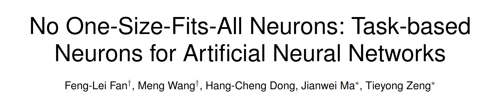

.. try_docs documentation master file, created by
   sphinx-quickstart on Sun Mar  3 01:45:49 2024.
   You can adapt this file completely to your liking, but it should at least
   contain the root `toctree` directive.

No One-Size-Fits-All Neurons
======================================

.. image:: https://img.shields.io/badge/downloads-100k-f39f37

.. important:: This is a important admonition.
   second important paragraph.

Installation
-------------
This page provides a brief introduction to graph matching and some guidelines for using pygmtools. If you are seeking some background information, this is the right place!

.. note:: This is a note admonition.
   This is the second line of the first paragraph.

   - The note contains all indented body elements
     following.
   - It includes this bullet list.

.. toctree::
   :hidden:
   :maxdepth: 1
   :caption: tnlearn

   Page_1
   Page_2
   Page_3
   Page_4

